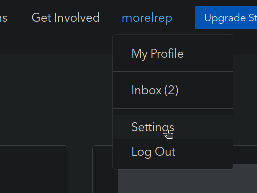
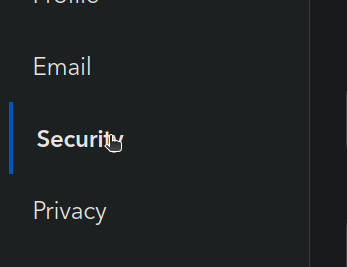
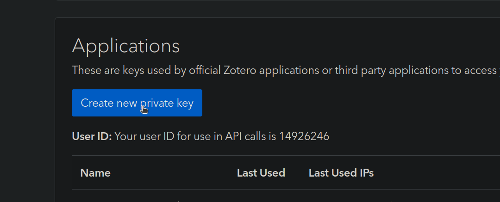

# Zotero - VIAF Reconciler

A Python script that automatically finds VIAF (Virtual International Authority File) identifiers for authors in your Zotero library and adds them as tags and CSV data to your items.

## Features

- **Smart Author Matching**: Searches Wikidata for author names with automatic fallback to name variations
- **User Confirmation**: Prompts for approval when potential matches are found via name variations  
- **Efficient Processing**: Skips items that already have sufficient VIAF tags based on creator count
- **CSV Export**: Stores results in Zotero's "extra" field as CSV for easy reference
- **Tag-Based Organization**: Adds VIAF IDs as tags (format: `VIAF{number}`) for easy filtering

## Quick Start

### 1. Clone and Setup
```bash
git clone <repository-url>
cd zotero-viaf-matcher
python3 -m venv venv
source venv/bin/activate  # On Windows: venv\Scripts\activate
```

### 2. Install Dependencies
```bash
pip install -r requirements.txt
```

### 3. Get Zotero API Credentials
1. Go to [Zotero.org](https://www.zotero.org) and log in
2. Click on your username → **Settings** → **Feeds/API**
  
3. Under **Applications**, create a new key with these permissions:
   - **Library access**: Read/Write
   - **Notes**: Read/Write  
   - **Tags**: Read/Write

4. Copy your **User ID** (shown at top of page) and **API Key**

### 4. Configure
Edit `main.py` and update these variables with your Zotero credentials:
```python
ZOTERO_USER_ID = "YOUR_USER_ID_HERE"  # From Zotero settings
ZOTERO_API_KEY = "YOUR_API_KEY_HERE"  # From Zotero API keys
LIBRARY_TYPE = "user"  # "user" or "group"
collection_name = "YOUR_ZOTERO_COLLECTION"  # Target collection to process
```

### 5. Run
```bash
python3 main.py
```

## How It Works

1. **Collection Selection**: Lists your collections and processes only the specified one
2. **Smart Filtering**: Skips items that already have enough VIAF tags (number of VIAF tags ≥ number of creators)
3. **Author Processing**: For each author in remaining items:
   - Tries exact name match in Wikidata
   - Falls back to name variations (removing initials, punctuation, accent normalization)
   - Prompts user confirmation for matches found via variations
4. **Data Storage**: 
   - Adds VIAF IDs as tags (e.g., `VIAF12345678`)
   - Stores full processing results as CSV in the "extra" field

## Usage

1. Set your Zotero credentials and target collection name in `main.py`
2. Run the script: `python3 main.py`
3. Monitor progress through detailed console output
4. Respond to match confirmation prompts when needed

## Output Format

### Tags
- `VIAF12345678` - One tag per found VIAF ID

### Extra Field (CSV)
```
FULL NAME,NATIONALITY,VIAF
John Smith,,12345678
Jane Doe,,87654321
```

## Name Variation Strategies

The script automatically tries these variations when exact matches fail:
- Remove middle initials (Fiódor M. Dostoievski → Fiódor Dostoievski)
- Remove punctuation and extra spaces
- Last name first format (John Smith → Smith, John)
- ASCII-fied versions (remove accents)

## Rate Limiting

Includes 1-second delays between API calls to be respectful to Wikidata servers.

## Troubleshooting

- Check that your Zotero API key has write permissions
- Ensure the collection name matches exactly (case-sensitive)
- Verify network connectivity to Wikidata API
- Review debug output in console for detailed processing information

## Notes

- Processes only top-level items (skips attachments and notes)
- Limited to 50 items per collection (adjustable in code)
- Preserves existing tags and extra field content